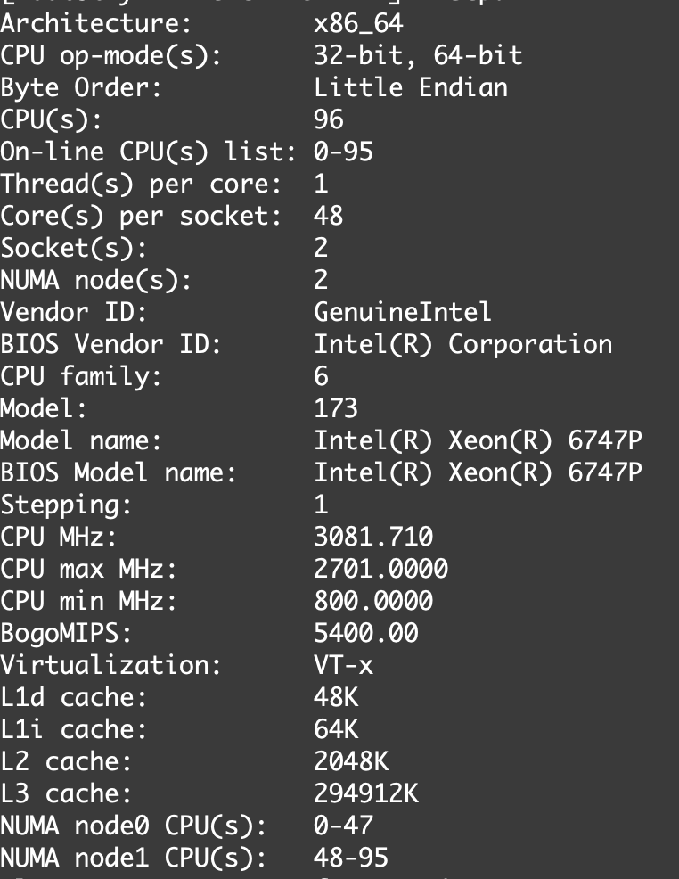
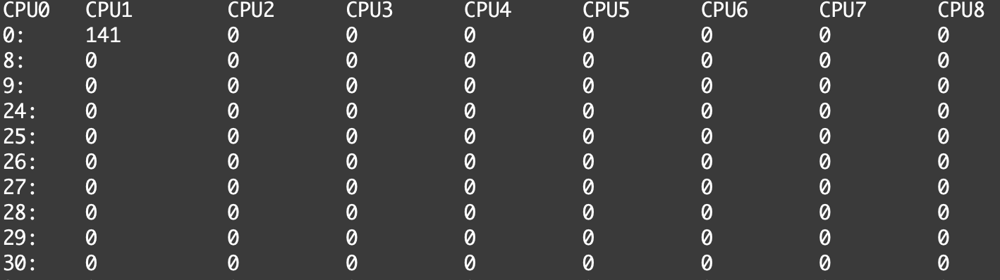
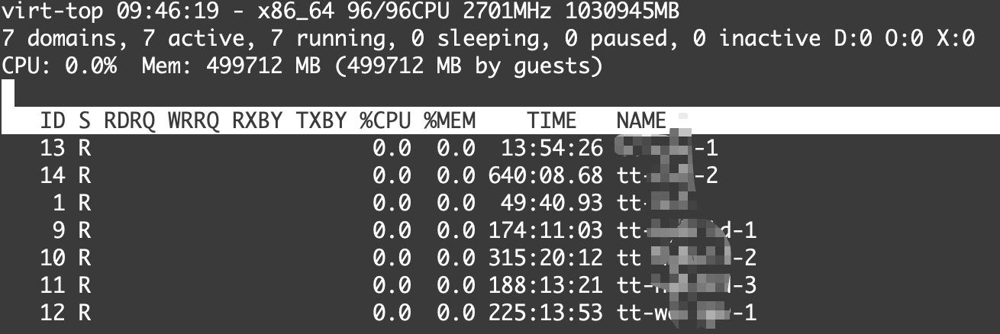

# CPU Optimization Overview

This document provides an overview of CPU-related bottlenecks on RHEL KVM hosts and the principles behind improving CPU determinism and latency for virtual machines.

## 1. Why CPU Optimization Matters
KVM performance is significantly affected by host CPU scheduling, interrupt handling, and contention between vCPUs and housekeeping tasks. Common symptoms of sub-optimal CPU configuration include:

- Unstable VM latency
- Reduced IOPS throughput on virtio disks
- High CPU steal time
- Uneven CPU load distribution
- Poor real-time behavior during I/O bursts

## 2. Key Optimization Areas

### 2.1 Disable HyperThreading (SMT)
HyperThreading shares execution resources between sibling threads, reducing determinism. Disabling HT improves vCPU isolation and I/O consistency.

Refer to `03_hyperthreading_disable.md` for full details.

---

### 2.2 Set CPU Governor to Performance
The default “ondemand” governor introduces latency when ramping CPU frequencies. The `performance` governor locks CPUs at max frequency to minimize jitter.

Refer to `04_cpu_governor.md`.

---

### 2.3 CPU Isolation
Prevent housekeeping tasks from interfering with dedicated vCPU cores by isolating host workloads.

Covered fully in: `05_cpu_isolation.md`.

---

### 2.4 CPU Pinning
Assign vCPUs and I/O threads to specific physical cores for deterministic scheduling.

See: `06_cpu_pinning.md`.

---

### 2.5 NUMA-Aware CPU Allocation
NUMA misalignment results in remote memory access, causing latency and IOPS degradation. Align vCPU, memory, and PCIe devices to the same NUMA node.

Covered in: `02_numa_optimization.md`.

---

## 3. Validation Commands

### Check CPU topology:
```bash
lscpu --extended (optional)
lscpu
```

### Check per-CPU interrupts:
```bash
cat /proc/interrupts
cat /proc/interrupts | column -t | less -S (for multi cores)
```

### Monitor vCPU steal time:
```bash
virt-top
```

### Verify governor:
```bash
cat /sys/devices/system/cpu/cpu0/cpufreq/scaling_governor
```

## 4. Summary

Optimizing CPU behavior is foundational for achieving stable low-latency performance on RHEL KVM hosts. Disabling HT, isolating CPUs, setting an appropriate governor, and applying NUMA-aware pinning collectively deliver predictable execution and improved storage throughput.