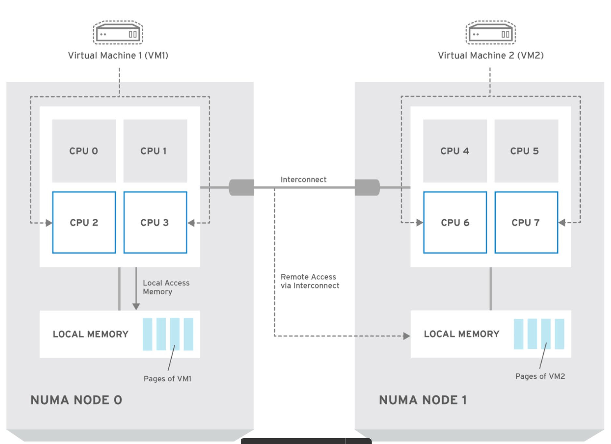
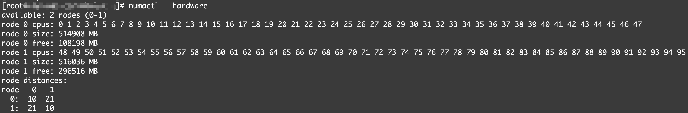
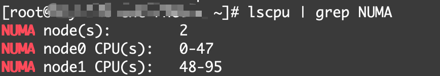

# NUMA Optimization Guide

NUMA (Non-Uniform Memory Access) is a computer memory architecture where memory is not equally accessible to all processors, while CPU pinning is the process of dedicating a virtual CPU to a specific physical CPU core.

Combining them, CPU pinning for NUMA systems ensures that a virtual machine's vCPUs are placed on a host's physical cores that are close to its local memory, reducing latency and improving performance for data-intensive workloads. 


## 1. Key NUMA Concepts

### 1.1 NUMA Node
A node contains CPUs, memory channels, and often PCIe/NVMe controllers. Accessing memory or devices on another NUMA node introduces latency.

### 1.2 Local vs Remote Access
- **Local:** CPU accesses memory/PCIe on its own node → optimal.
- **Remote:** CPU accesses another node’s memory → slower.

### 1.3 NUMA-aware VM placement
vCPUs, memory, and storage interrupts must align to the same node.

---

## 2. Inspect NUMA Topology

### List nodes:
```bash
numactl --hardware
lscpu | grep NUMA
```

